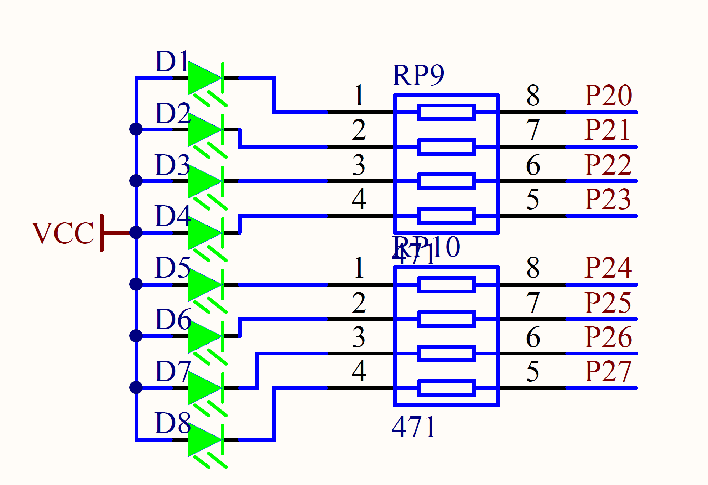
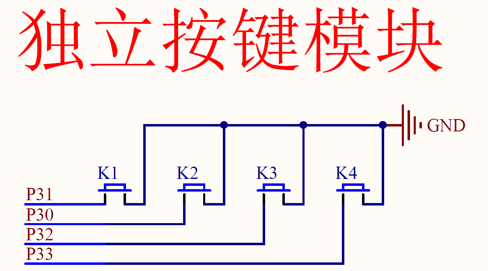
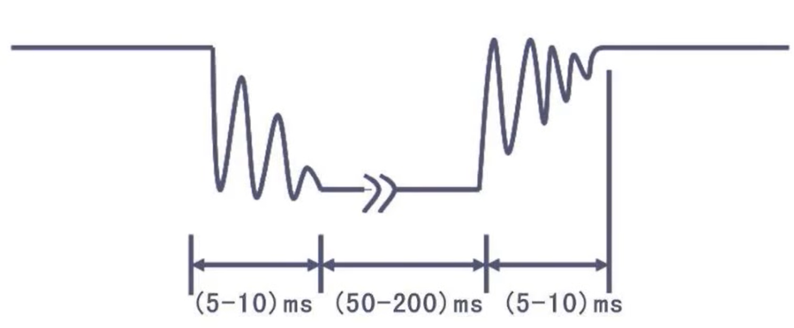
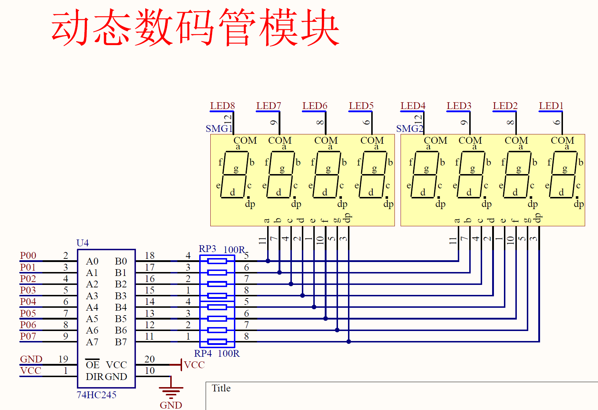
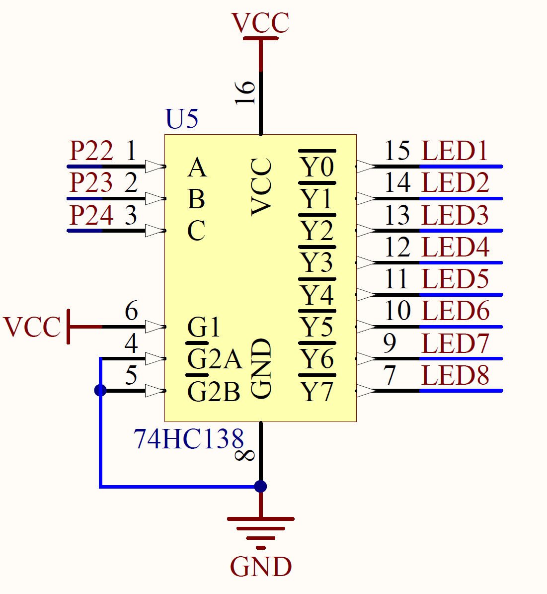

# 单片机

## 点亮一个LED灯



电阻的作用是限流

控制引脚输出高低电频 

配置P2口的寄存器的值

## 独立按键控制LED的亮与灭



按下为低电频

**按键的抖动**



首先一个大循环，判断是否按下
如果按下，if为true，则延时10ms进行过滤
继续循环判断当前是否是按下的状态，若松开则延时10ms过滤
进行取反

```c
while(1){
		if(P3_1==0)		//是否按下
		{
			Delay(10);
			while(P3_1==0);		//是否松开
			Delay(10);
			P2_0=~P2_0;			//执行按过之后的命令
		}
	
	}
```

## 数码管



74HC245为双向数据缓冲器

LED1-8的亮灭由74HC138译码器实现

重影则需要进行消影操作

**数码管的驱动方式**

1. 单片机直接扫描:硬件设备简单，但会耗费大量的单片机CPU时间
2. 专用驱动芯片:内部自带显存、扫描电路，单片机，只需告诉它显示什么即可

# 定时器

SYSclk :系统时钟，即晶振周期，本开发板上的晶振为12MHz
